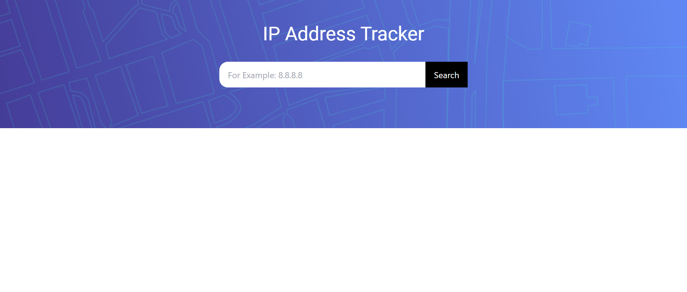
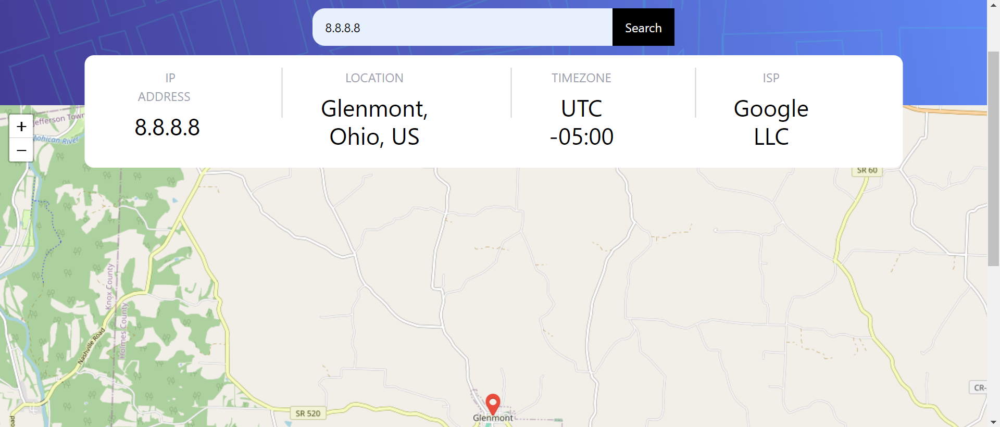

# 🚀 IP Address Tracker 🚀

This is a solution to the [IP address tracker challenge on Frontend Mentor](https://www.frontendmentor.io/challenges/ip-address-tracker-I8-0yYAH0). Frontend Mentor challenges help you improve your coding skills by building realistic projects.

## Table of contents

- [🚀 IP Address Tracker 🚀](#-ip-address-tracker-)
  - [Table of contents](#table-of-contents)
  - [Overview](#overview)
    - [The challenge](#the-challenge)
    - [Screenshot](#screenshot)
    - [Links](#links)
  - [My process](#my-process)
    - [Built with](#built-with)
  - [Author](#author)

**Note: Delete this note and update the table of contents based on what sections you keep.**

## Overview

### The challenge

Users should be able to:

- View the optimal layout for each page depending on their device's screen size
- See hover states for all interactive elements on the page
- See their own IP address on the map on the initial page load
- Search for any IP addresses or domains and see the key information and location

### Screenshot

### Links

- Solution URL: [Click here](https://github.com/chayansurana3/IP-Address-Tracker.git)
- Live Site URL: [Click here](https://ip-address-trackings.netlify.app/)

## My process

### Built with

- Semantic HTML5 markup
- CSS custom properties
- Flexbox
- CSS Grid
- Mobile-first workflow
- [React](https://reactjs.org/) - JS library

## Author

- Website - [Chayan Surana](https://chayansurana.netlify.app/)
- Frontend Mentor - [@chayansurana3](https://www.frontendmentor.io/profile/chayansurana3)
- Twitter - [@chayan_surana_](https://twitter.com/chayan_surana_)
